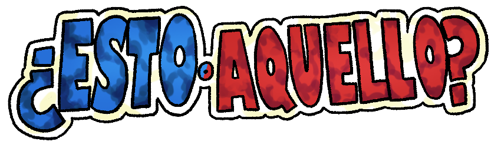
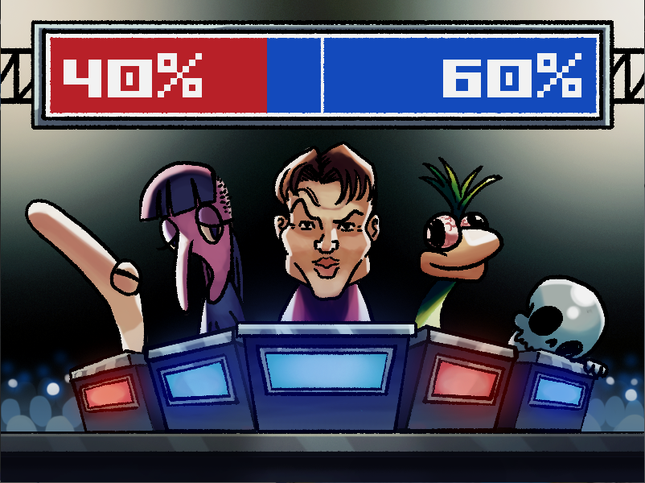
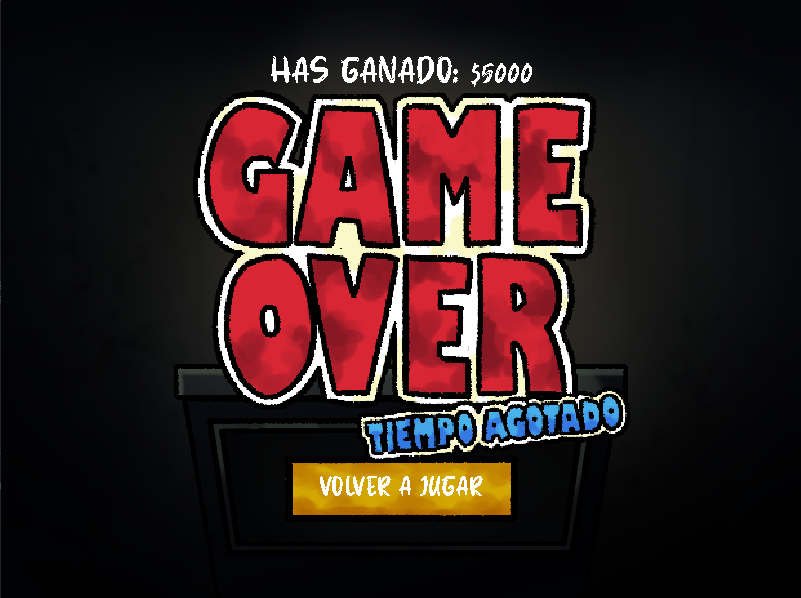

  

<h3 align="center">Nicolas Culetto y Leandro Gomez</h3>

🌟 Vive la Experiencia de Ser un Participante en el Famoso Programa de Televisión: ¿Esto o Aquello? 🌟
¡Sumérgete en la aventura televisiva definitiva donde cada elección cuenta! En este juego, controlas a un participante en el emocionante programa ¿Esto o Aquello?. ¿Estás listo para enfrentar desafíos electrizantes y tomar decisiones cruciales? ¡Demuestra tu habilidad y conviértete en el campeón del programa más famoso de la televisión

 

  

 

  <h2 align="center"> Previsualizacion de la pantalla de juego </h2>
  

 

  <h2 align="center">Desarrollo del juego</h2>
  

    

      Deberás responder a una consigna eligiendo entre la opción roja o azul. Si tu elección coincide con la opción más votada por nuestros 5 jurados, avanzarás triunfalmente a la siguiente ronda. Pero cuidado, si te equivocas, perderás y tendrás que conformarte con lo poco que hayas ganado. ¡Asegúrate de pensar bien antes de tomar tu decisión! 

     
    
    
  

 

  <h1 align="center">Comodines</h1>
  <table>
        <tr>
            <td>
                
            </td>
            <td>
                 
<b>RECARGAR</b>

                
Cambia la pregunta actual por una distinta.

            </td>
        </tr>
        <tr>
            <td>
                
            </td>
            <td>
                
<b>MOSTRAR MITAD</b>

                
Se mostrará 2 respuestas del jurado

            </td>
        </tr>
        <tr>
            <td>
                
            </td>
            <td>
                
<b>SIGUIENTE</b>

                
Muestra los resultados, y pasa al siguiente nivel como si hubiera elegido lapregunta correcta

            </td>
        </tr>
    </table>
    

  

<h3>Descripcion</h3>

- 🔭 Paradigma utilizado **POO**

- 🌱 Diseño de imagenes propias

- 👨‍💻 Creatividad e innovacion

- 💬 Tecnologias Utilizadas **Python, Libreria Pygame**

- 📫 Contacto **lean.nahu.gomez@gmail.com** | **anawello18@gmail.com**

- ⚡ Juego creado para el segundo parcial de programación del primer cuatrimestre de la Tecnicatura de programación de UTN Fra
 

  <ul align="center">
    <h2 style="display: inline-block">Tecnologias usadas</h2>

  </ul>

  

